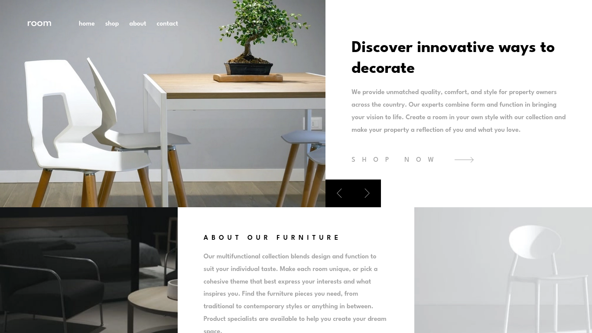
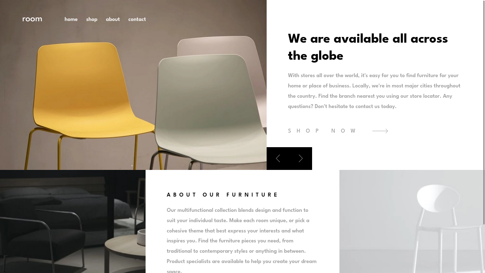
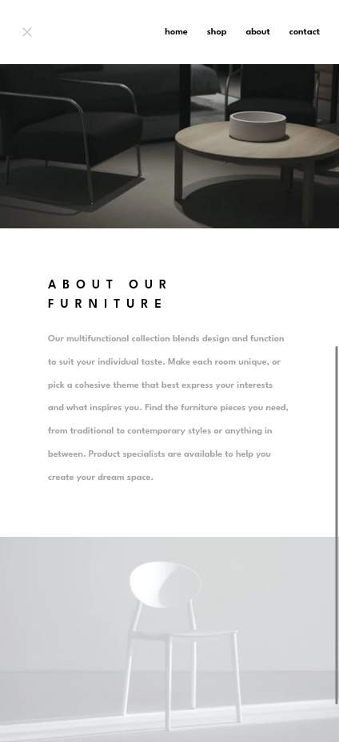

# Frontend Mentor - Room homepage solution

This is a solution to the [Room homepage challenge on Frontend Mentor](https://www.frontendmentor.io/challenges/room-homepage-BtdBY_ENq). Frontend Mentor challenges help you improve your coding skills by building realistic projects.

## Overview

### Screenshot

  

### Links

- [Repository](https://github.com/zaarza/room-homepage)
- [Live preview](https://room-homepage-zaarza.vercel.app/)

## My process

### The challenge

- View the optimal layout for the site depending on their device's screen size
- See hover states for all interactive elements on the page
- Navigate the slider using either their mouse/trackpad or keyboard

### Framework / Library / Tools used

- NextJs
- Typescript
- SASS
- Font-size Clamp Generator by Walbo
- Aspect Ratio Calculator by Andrew

### Useful Resources

- Google Fonts

## Author

- Website - [Arzaqul Mughny Al Fawwaz](https://www.zaarza.github.io)
- Frontend Mentor - [@zaarza](https://www.frontendmentor.io/profile/zaarza)
